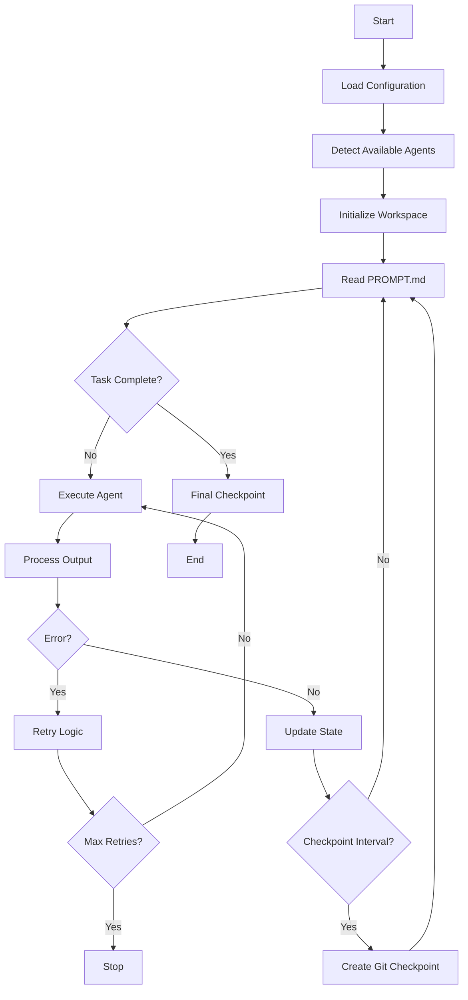

# System Architecture

## Overview

Ralph Orchestrator implements a simple yet effective architecture based on the Ralph Wiggum technique - a continuous loop pattern that runs AI agents until task completion.

## Core Components

### 1. Orchestration Engine

The heart of Ralph is the orchestration loop in `ralph_orchestrator.py`:

```python
while not task_complete:
    execute_agent()
    check_completion()
    handle_errors()
    checkpoint_if_needed()
```

### 2. Agent Abstraction Layer

Ralph supports multiple AI agents through a unified interface:

- **Claude** (Anthropic Claude Code CLI)
- **Q Chat** (Q CLI tool) 
- **Gemini** (Google Gemini CLI)

Each agent is executed through subprocess calls with consistent error handling and output capture.

### 3. State Management

```
.agent/
├── metrics/        # Performance and state data
├── checkpoints/    # Git checkpoint markers
├── prompts/        # Archived prompt history
└── plans/          # Agent planning documents
```

### 4. Git Integration

Ralph uses Git for:
- **Checkpointing**: Regular commits for recovery
- **History**: Track code evolution
- **Rollback**: Reset to last known good state

## System Flow



## Design Principles

### 1. Simplicity Over Complexity
- Core orchestrator is ~400 lines of Python
- No external dependencies beyond AI CLI tools
- Clear, readable code structure

### 2. Fail-Safe Operations
- Automatic retry with exponential backoff
- State persistence across failures
- Git checkpoints for recovery

### 3. Agent Agnostic
- Unified interface for all AI agents
- Auto-detection of available tools
- Graceful fallback when agents unavailable

### 4. Observable Behavior
- Comprehensive logging
- Metrics collection
- State inspection tools

## Directory Structure

```
ralph-orchestrator/
├── ralph_orchestrator.py     # Core orchestration engine
├── ralph                     # Bash wrapper script
├── PROMPT.md                # User task definition
├── .agent/                  # Ralph workspace
│   ├── metrics/            # JSON state files
│   │   └── state_*.json
│   ├── checkpoints/        # Git checkpoint markers
│   │   └── checkpoint_*.txt
│   ├── prompts/            # Archived prompts
│   │   └── prompt_*.md
│   └── plans/              # Planning documents
│       └── *.md
└── test_comprehensive.py    # Test suite
```

## Key Classes and Functions

### RalphOrchestrator Class

```python
class RalphOrchestrator:
    def __init__(self, config: Dict):
        """Initialize orchestrator with configuration"""
        
    def run(self) -> Dict:
        """Main orchestration loop"""
        
    def execute_agent(self, agent: str, prompt: str) -> Tuple:
        """Execute AI agent with prompt"""
        
    def check_task_complete(self, prompt_file: str) -> bool:
        """Check if task is marked complete"""
        
    def create_checkpoint(self, iteration: int):
        """Create Git checkpoint"""
        
    def save_state(self):
        """Persist current state to disk"""
```

### Agent Execution

```python
def execute_agent(agent: str, prompt: str) -> Tuple[bool, str]:
    """Execute AI agent and capture output"""
    cmd = [agent, prompt]
    result = subprocess.run(
        cmd,
        capture_output=True,
        text=True,
        timeout=300
    )
    return result.returncode == 0, result.stdout
```

## Error Handling

### Retry Strategy
1. Initial attempt
2. Exponential backoff (2, 4, 8, 16 seconds)
3. Maximum 5 consecutive failures
4. State preserved between attempts

### Recovery Mechanisms
- Git reset to last checkpoint
- Manual intervention points
- State file analysis tools

## Performance Considerations

### Resource Usage
- Minimal memory footprint (~50MB)
- CPU bound by AI agent execution
- Disk I/O for state persistence

### Scalability
- Single task execution (by design)
- Parallel execution via multiple instances
- No shared state between instances

## Security

### Process Isolation
- AI agents run in subprocess
- No direct code execution
- Sandboxed file system access

### Git Safety
- No force pushes
- Checkpoint-only commits
- Preserves user commits

## Monitoring

### Metrics Collection
```json
{
  "iteration_count": 15,
  "runtime": 234.5,
  "agent": "claude",
  "errors": [],
  "checkpoints": [5, 10, 15]
}
```

### Health Checks
- Agent availability detection
- Prompt file validation
- Git repository status

## Future Architecture Considerations

### Potential Enhancements
1. **Plugin System**: Dynamic agent loading
2. **Web Interface**: Browser-based monitoring
3. **Distributed Execution**: Task parallelization
4. **Cloud Integration**: Remote execution support

### Maintaining Simplicity
Any architectural changes should:
- Preserve the core loop simplicity
- Maintain the "unpossible" philosophy
- Keep dependencies minimal
- Ensure deterministic behavior