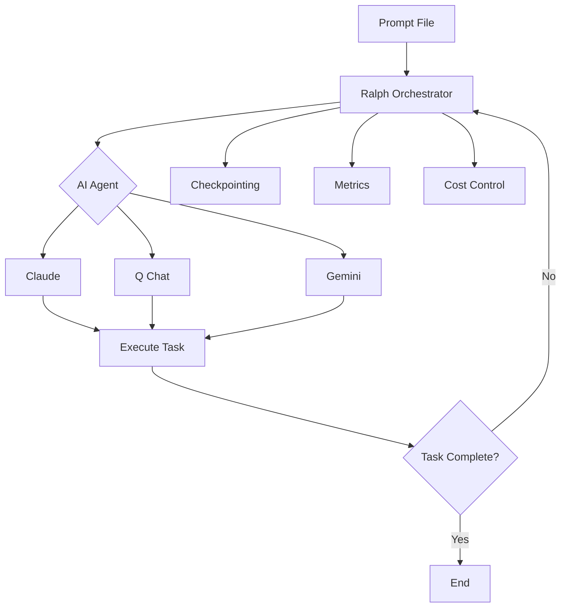
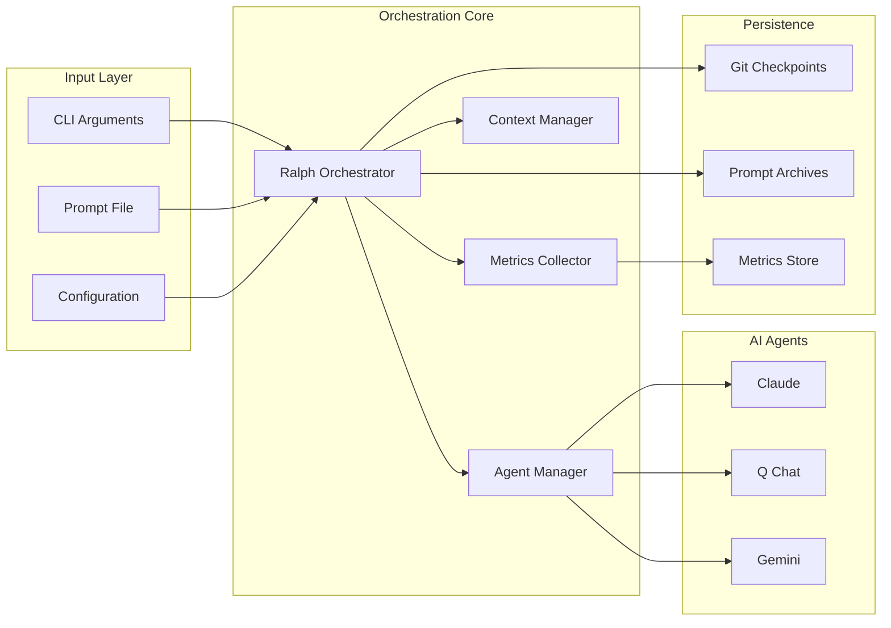

# Overview

## What is Ralph Orchestrator?

Ralph Orchestrator is a production-ready implementation of the Ralph Wiggum orchestration technique for AI agents. It provides a robust framework for running AI agents in a continuous loop until a task is completed, with enterprise-grade safety, monitoring, and cost controls.

The system is named after Ralph Wiggum from The Simpsons, embodying the philosophy of persistent iteration: "Me fail English? That's unpossible!" - just keep trying until you succeed.

## Key Concepts

### The Ralph Wiggum Technique

At its core, as [Geoffrey Huntley](https://ghuntley.com/ralph/) originally defined it: **"Ralph is a Bash loop."**

```bash
while :; do cat PROMPT.md | claude ; done
```

This simple yet powerful approach to AI orchestration is "deterministically bad in an undeterministic world" - it fails predictably but in ways you can address. The technique requires "faith and belief in eventual consistency," improving through iterative tuning.

The workflow is straightforward:

1. **Give the AI a task** via a prompt file (PROMPT.md)
2. **Let it iterate** continuously on the problem
3. **Monitor progress** through checkpoints and metrics
4. **Stop when complete** or when limits are reached

This approach leverages the AI's ability to self-correct and improve through multiple iterations, inverting typical AI workflows by defining success criteria upfront rather than directing step-by-step.

### Enhanced Implementation: Claude Code Plugin

The official [ralph-wiggum plugin](https://github.com/anthropics/claude-code/tree/main/plugins/ralph-wiggum) for Claude Code extends the basic technique with:

- **Stop Hook Mechanism**: Intercepts exit code 2 to re-inject prompts and continue iteration
- **Iteration Limits**: Primary safety mechanism to prevent runaway loops
- **Completion Promises**: Optional string matching to detect task completion
- **Full Context Preservation**: Each cycle has access to modified files and git history from previous runs

**Available commands:**

| Command                  | Description                                               |
| ------------------------ | --------------------------------------------------------- |
| `/ralph-loop "<prompt>"` | Start an autonomous loop with optional `--max-iterations` |
| `/cancel-ralph`          | Stop an active Ralph loop                                 |
| `/help`                  | Display plugin help and documentation                     |

For detailed Claude Code integration, see [paddo.dev/blog/ralph-wiggum-autonomous-loops](https://paddo.dev/blog/ralph-wiggum-autonomous-loops/).

### Core Components



!!! warning "Cost Awareness"
Autonomous loops consume significant tokens. **A 50-iteration cycle on large codebases can cost $50-100+ in API credits**, quickly exhausting subscription limits. Always set iteration limits and monitor costs carefully. See [Cost Management](cost-management.md) for strategies.

## How It Works

### 1. Initialization Phase

When you start Ralph Orchestrator, it:

- Validates the prompt file for security
- Detects available AI agents
- Sets up monitoring and metrics collection
- Creates working directories for checkpoints
- Initializes cost and token tracking

### 2. Iteration Loop

The main orchestration loop:

1. **Pre-flight checks**: Verify token/cost limits haven't been exceeded
2. **Context management**: Check if context window needs summarization
3. **Agent execution**: Run the selected AI agent with the prompt
4. **Response processing**: Capture and analyze the agent's output
5. **Metrics collection**: Track tokens, costs, and performance
6. **Progress evaluation**: Monitor progress towards objectives
7. **Checkpoint**: Save state at configured intervals
8. **Repeat**: Continue until task is complete or limits are reached

### 3. Safety Mechanisms

Multiple layers of protection ensure safe operation:

```
                                 🛡️ Five Safety Mechanisms

  ┌───────────────────┐     ┌───────────────────┐     ┌───────────────────┐
  │  Iteration Limit  │     │   Runtime Limit   │     │    Cost Limit     │
  │ (default: 100)    │     │   (default: 4h)   │     │   (default: $10)  │
  └───────────────────┘     └───────────────────┘     └───────────────────┘
            │                         │                         │
            │                         │                         │
            ∨                         ∨                         ∨
          ╔═══════════════════════════════════════════════════════╗
          ║                    SafetyGuard.check()                ║
          ╚═══════════════════════════════════════════════════════╝
            ∧                         ∧                         ∧
            │                         │                         │
            │                         │                         │
  ┌───────────────────┐     ┌───────────────────┐     ┌───────────────────┐
  │ Consecutive Fails │     │   Loop Detection  │     │ Completion Marker │
  │   (default: 5)    │     │   (90% similar)   │     │ [x] TASK_COMPLETE │
  └───────────────────┘     └───────────────────┘     └───────────────────┘
```

<details>
<summary>graph-easy source</summary>

```
graph { label: "🛡️ Five Safety Mechanisms"; flow: south; }
[ Iteration Limit (default: 100) ] -> [ SafetyGuard.check() ] { border: double; }
[ Runtime Limit (default: 4h) ] -> [ SafetyGuard.check() ]
[ Cost Limit (default: $10) ] -> [ SafetyGuard.check() ]
[ Consecutive Fails (default: 5) ] -> [ SafetyGuard.check() ]
[ Loop Detection (90% similar) ] -> [ SafetyGuard.check() ]
[ Completion Marker [x] TASK_COMPLETE ] -> [ SafetyGuard.check() ]
```

</details>

- **Input validation**: Sanitizes prompts to prevent injection attacks
- **Resource limits**: Enforces iteration, runtime, and cost boundaries
- **Completion markers**: Early exit when `- [x] TASK_COMPLETE` detected in prompt file
- **Completion promises**: Early exit when agent output contains a configured string (default: `LOOP_COMPLETE`)
- **Loop detection**: Stops when agent outputs are ≥90% similar to recent history
- **Consecutive failure limit**: Stops after repeated failures (default: 5)
- **Context overflow**: Automatically summarizes when approaching limits
- **Graceful shutdown**: Handles interrupts and saves state
- **Error recovery**: Retries with exponential backoff

See [Loop Detection](../advanced/loop-detection.md) for detailed documentation on output similarity detection.

### 4. Completion

When the task completes or limits are reached:

- Final metrics are saved
- State is persisted for analysis
- Usage statistics are reported
- Detailed logs are exported

## Use Cases

Ralph Orchestrator excels at:

### Optimal Use Cases

- **Large Refactors**: Framework migrations, dependency upgrades
- **Batch Operations**: Documentation generation, code standardization
- **Test Coverage Expansion**: Generating comprehensive test suites
- **Greenfield Project Scaffolding**: New project setup and boilerplate

### Not Recommended For

- Ambiguous requirements lacking clear completion criteria
- Architectural decisions requiring human reasoning
- Security-sensitive code (authentication, payments)
- Exploratory work requiring human curiosity

!!! info "Real-World Results (2024-2025)"
The technique has proven effective at scale:

    - **Y Combinator Hackathon**: Team shipped 6 repositories overnight using Ralph loops
    - **Contract MVP**: One engineer completed a $50,000 contract for just **$297** in API costs
    - **Language Development**: Geoffrey Huntley's 3-month loop created a complete esoteric programming language (CURSED) - the AI successfully programs in a language it invented that doesn't exist in any training data

    These results demonstrate that with clear prompts and patience, Ralph can replace substantial outsourcing work for new projects.

### Software Development

- Writing complete applications from specifications
- Refactoring large codebases
- Implementing complex features iteratively
- Debugging difficult issues

### Content Creation

- Writing comprehensive documentation
- Generating test suites
- Creating API specifications
- Developing training materials

### Data Processing

- Analyzing large datasets
- Generating reports
- Data transformation pipelines
- ETL operations

### Research & Analysis

- Literature reviews
- Market research
- Competitive analysis
- Technical investigations

## Benefits

### 🚀 Productivity

- Automate complex, multi-step tasks
- Reduce human intervention
- Parallelize work across multiple agents
- 24/7 operation capability

### 💰 Cost Management

- Real-time cost tracking
- Configurable spending limits
- Per-agent pricing models
- Token usage optimization

### 🔒 Security

- Input sanitization
- Command injection prevention
- Path traversal protection
- Audit trails

### 📊 Observability

- Detailed metrics collection
- Performance monitoring
- Success/failure tracking
- Resource utilization

### 🔄 Reliability

- Automatic retries
- State persistence
- Checkpoint recovery
- Graceful degradation

## Architecture Overview



## Getting Started

To start using Ralph Orchestrator:

1. **Install the tool** and at least one AI agent
2. **Create a prompt file** with your task
3. **Run the orchestrator** with appropriate limits
4. **Monitor progress** through logs and metrics
5. **Retrieve results** when complete

See the [Quick Start](../quick-start.md) guide for detailed instructions.

## Next Steps

- Learn about [Configuration](configuration.md) options
- Understand [Agent](agents.md) selection and capabilities
- Master [Prompt](prompts.md) engineering for best results
- Explore [Cost Management](cost-management.md) strategies
- Set up [Checkpointing](checkpointing.md) for recovery
